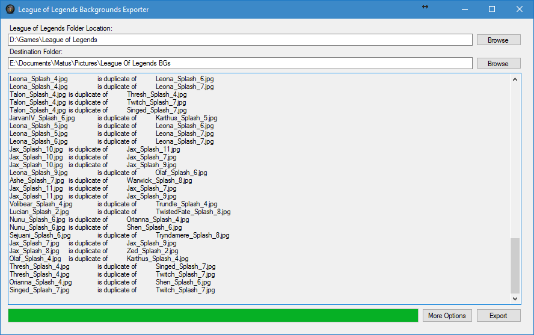

lolbgs
======

League of Legends Backgrounds Exporter
```diff
- Doesn't work with new client.
```
<hr>
<b>Done:</b>

* Auto find League folder (Tested only with Installed LoL, dunno if works with copied version)
* IgnoreList for exact splash arts
* Allowed Champions List (if you don't want backgrouds from everyone)
* Copy All splash arts
* mailto: me :)
* Search in Allowed Champions
* Auto Ignore not finished splash arts
* Check for Duplicates (TPA, SKT T1, ...)

<hr>
<b>To Do:</b>

* Set images as Dekstop Backgrounds (Vista+)
<hr>



