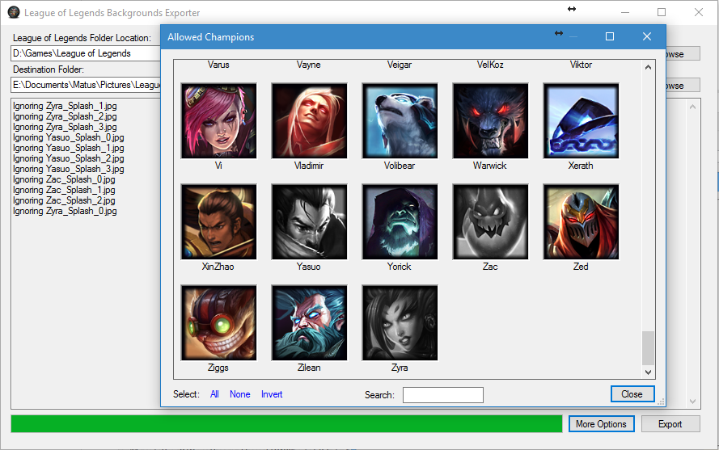

lolbgs
======

League of Legends Backgrounds Exporter

<b>Done:</b>
* Auto find League folder (Tested only with Installed LoL, dunno if works with copied version)
* IgnoreList for exact splash arts
* Allowed Champions List (if you don't want backgrouds from everyone)
* Copy All splash arts
* mailto: me :)

<b>To Do:</b>
* Search in Allowed Champions
* Auto Ignore not finished splash arts

